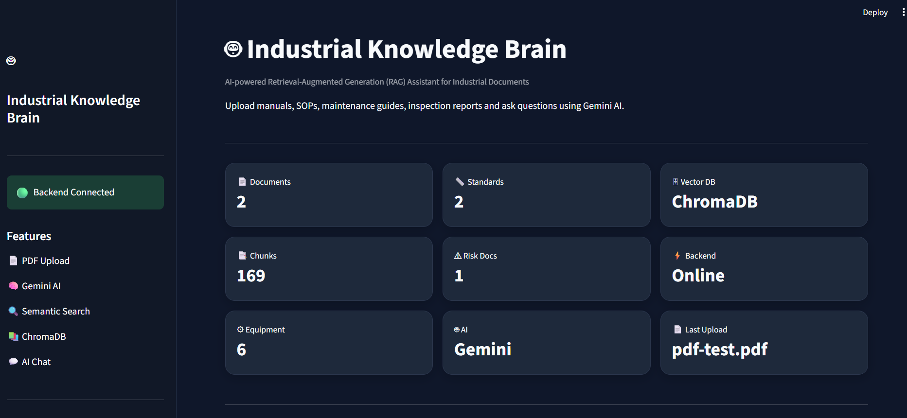
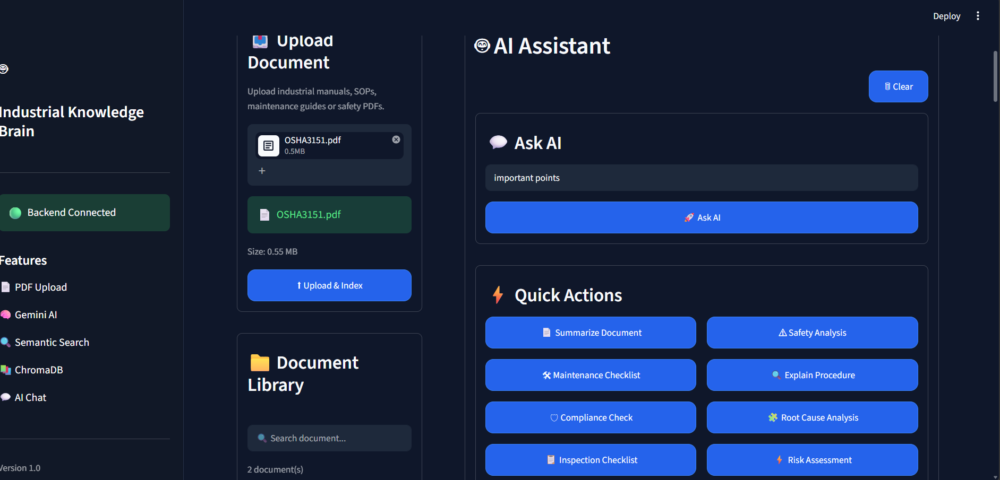
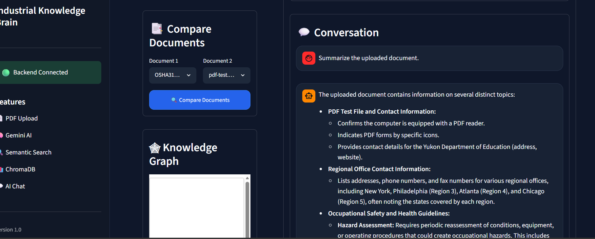
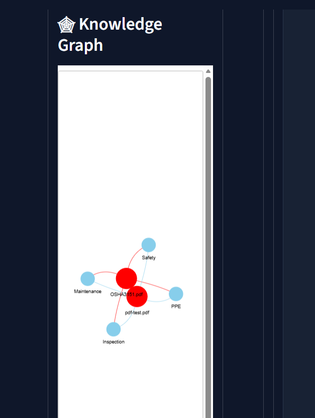

# 🤖 Industrial Knowledge Brain

> AI-Powered Industrial Knowledge Intelligence Platform for Industrial Documents


---

# 📌 Problem Statement

Industrial organizations manage thousands of maintenance manuals, SOPs, inspection reports, safety procedures, engineering documents, and operational records.

Finding relevant information quickly is difficult because documents are:

- Scattered across different formats
- Unstructured
- Difficult to search
- Time-consuming to analyze manually

Industrial Knowledge Brain transforms these documents into an AI-powered searchable knowledge base.

---

# 🚀 Features

## 📄 Intelligent PDF Upload

- Upload industrial documents
- Automatic text extraction
- Automatic indexing

---

## 🔍 OCR Support

Supports:

- Scanned PDFs
- Image-based PDFs

Uses:

- Tesseract OCR
- pdf2image

---

## 🤖 AI Assistant

Powered by:

- Google Gemini 2.5 Flash
- Retrieval-Augmented Generation (RAG)

Capabilities:

- Question Answering
- Document Summarization
- Maintenance Checklist
- Safety Analysis
- Procedure Explanation

---

## 📚 Source Citations

Every AI response includes:

- Source document
- Chunk number
- Evidence

---

## 📑 Document Comparison

Compare two industrial documents and identify:

- Similarities
- Differences
- Maintenance procedures
- Safety instructions
- Compliance requirements
- Recommendations

---

## 🕸 Knowledge Graph

Interactive visualization showing relationships between:

- Documents
- Maintenance
- Safety
- Inspection
- PPE

---

## 📊 Dashboard

Displays:

- Total Documents
- Indexed Chunks
- AI Model
- Vector Database
- Backend Status
- Last Uploaded Document

---

## 📁 Document Library

- Search documents
- Delete documents
- Manage uploaded files

---

# 🏗 System Architecture

```
                User
                  │
                  ▼
        Streamlit Frontend
                  │
                  ▼
          FastAPI Backend
      ┌─────────┼──────────┐
      ▼         ▼          ▼
 PDF Upload   OCR     Entity Extraction
      │
      ▼
 Text Chunking
      │
      ▼
 Gemini Embeddings
      │
      ▼
     ChromaDB
      │
      ▼
 Semantic Search
      │
      ▼
 Gemini 2.5 Flash
      │
      ▼
 AI Response + Sources
```

---

# 🛠 Tech Stack

## Frontend

- Streamlit

## Backend

- FastAPI

## AI

- Google Gemini 2.5 Flash

## Embeddings

- Gemini Embedding API

## Vector Database

- ChromaDB

## OCR

- Tesseract OCR
- pdf2image

## Language

- Python

---

# 📂 Project Structure

```
Industrial-Knowledge-Brain/

backend/
│
├── app/
│   ├── api/
│   ├── services/
│   ├── schemas/
│   ├── core/
│   └── main.py
│
frontend/
│
├── components/
├── styles/
├── api.py
└── app.py

uploads/

chroma_db/

README.md

requirements.txt
```

---

# ⚙ Installation

## Clone Repository

```bash
git clone https://github.com/sneha140305/Industrial-Knowledge-Brain.git

cd Industrial-Knowledge-Brain
```

---

## Create Virtual Environment

```bash
python -m venv venv
```

Activate

Windows

```bash
venv\Scripts\activate
```

Linux/Mac

```bash
source venv/bin/activate
```

---

## Install Dependencies

```bash
pip install -r requirements.txt
```

---

# ▶ Run Backend

```bash
cd backend

uvicorn app.main:app --reload
```

Backend

```
http://127.0.0.1:8000
```

Swagger

```
http://127.0.0.1:8000/docs
```

---

# ▶ Run Frontend

```bash
cd frontend

streamlit run app.py
```

Frontend

```
http://localhost:8501
```

---

# 📸 Screenshots

## Dashboard


---

## AI Assistant


---

## Document Upload


---

## Document Comparison


---

## Knowledge Graph


---

# 🎥 Demo Workflow

1. Upload industrial document

2. OCR extracts scanned text

3. ChromaDB indexes chunks

4. Ask AI questions

5. Compare documents

6. View Knowledge Graph

7. Review source evidence

---

# 📈 Future Scope

- Neo4j Knowledge Graph
- IoT Sensor Integration
- Predictive Maintenance
- Root Cause Analysis
- Regulatory Compliance Automation
- Mobile Application
- Multi-language Support

---

# 👩‍💻 Developed By

**Sneha Choudhary**

GitHub

https://github.com/sneha140305

---

# ⭐ If you found this project useful, please consider giving it a star!